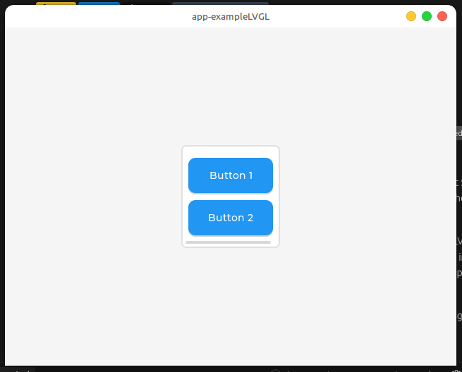
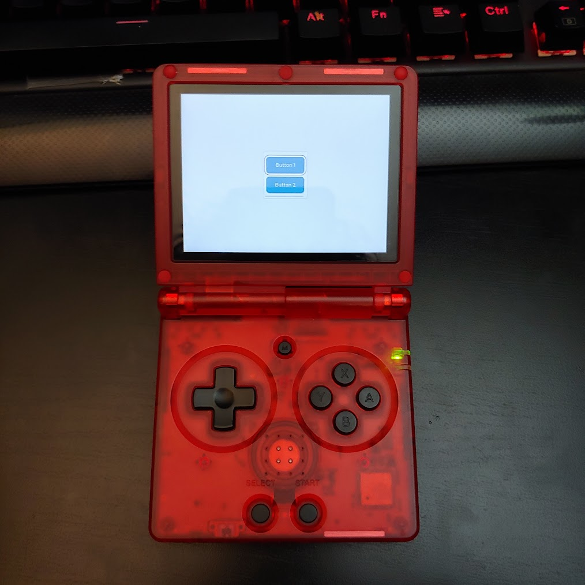

# PureC-LVGL-v9-SDL2-Example-Without-Display-Driver

[](https://lvgl.io/)
[](https://www.libsdl.org/)
[]()
[]()
[]()

### Platforms
[]()
[]()
[]()
[]()

### Architectures
[]()
[]()
[]()
[]()

### Development
[]()
[]()
[]()
[]()
[]()
[]()
[]()
[]()

A cross-platform example application demonstrating the latest LVGL (9.3) in pure C. Using direct SDL2 access without any display drivers. This project showcases modern UI development and comprehensive input support in a low level language.

This project was started as an attempt to make a muOS application using pure C and the latest LVGL. Due to a custom SDL2 integration in muOS, this project bypasses all LVGL display drivers and utilizes an internal buffer to directly draw to the screen. This should allow the app even greater cross-platform support as it doesn't rely on the SDL display driver. 

Due to the low level implementation of this app it should be compatible with nearly all operating systems and embedded environments. 

If SDL2 can draw to your screen, then your device can run this app. 

#### TODO
- make multiple controllers work at the same time(ez im just lazy and keep forgetting about this)

## 🚀 Features

- 🖥️ Pure C implementation
- 🏎️ EXTREMELY fast, lightweight, and resource efficient
- ✅ Valgrind tested for proper memory management (no leaks)
- 🎮 Full gamepad support with SDL2
- ⌨️ Keyboard and mouse input handling
- 📱 Cross-platform compatibility
- 🖼️ Hardware-accelerated graphics
- 🎯 Dynamic window resizing
- 📦 Comprehensive build system
- 🔄 Double-buffered rendering
- 🎨 Modern UI with LVGL 9.3

## 📸 Screenshots

### Desktop Screenshot


### muOS Screenshot



## 📋 Build Prerequisites

- SDL2 development libraries installed
- SDL2_ttf development libraries installed (Will be removed in the future)
- GCC/Make build tools
- For ARM64 cross-compilation:
  - ARM64 toolchain
  - ARM64 SDL2 libraries
  - Raspberry Pi will make things a lot easier if you only have x86 computers

## 🛠️ Installation

### Normal Install

Move the app-exampleLVGL folder from the repo into your muOS applications folder

OR 

Place release archive in ARCHIVE folder of your muOS sdcard then install with archive manager


Done!


<br>
<br>
<br>

### Building From Scratch (For Devs)

For native (x86) build:
```bash
cd app-exampleLVGL
make
```

For ARM64 build:
```bash
# Use a raspberry pi

# update the make-rpi.sh script with your ssh credentials

./make-rpi.sh

# To automatically upload to your muOS device do:

./make-rpi.sh -upload
```


## 📁 Project Structure

```
PureC-LVGL-9.3-SDL2-Example-Without-Display-Driver/
├── app-exampleLVGL/           # Main application directory
│   ├── components/           # External components
│   │   └── lvgl/            # Place LVGL 9.3 library here
│   ├── main/                # Application source code
│   │   ├── config/         # Configuration files
│   │   │   └── lv_conf.h   # LVGL configuration
│   │   ├── fonts/         # Font resources
│   │   ├── input.c        # Input handling
│   │   ├── input.h        # Input declarations
│   │   └── main.c         # Main application
│   ├── Makefile           # Build configuration
│   ├── mux_launch.sh      # Launch script for muOS
│   └── valgrind.supp      # Valgrind suppressions
├── make_rpi.sh            # Raspberry Pi build script
├── README.md              # Project documentation
└── upload.sh              # Device upload script
```

## 🎮 Input Support

### Gamepad
- Full SDL2 gamepad support
- Configurable button mappings
- Multiple controller support
- Hot-plugging support

### Keyboard & Mouse
- Complete keyboard navigation
- Mouse interaction support
- Focus management
- Scroll wheel support

## 🖥️ Display Features

- Hardware-accelerated rendering
- Double-buffered display
- Dynamic resolution support
- Partial screen updates
- ARGB8888 32-bit color format
- Vsync support

